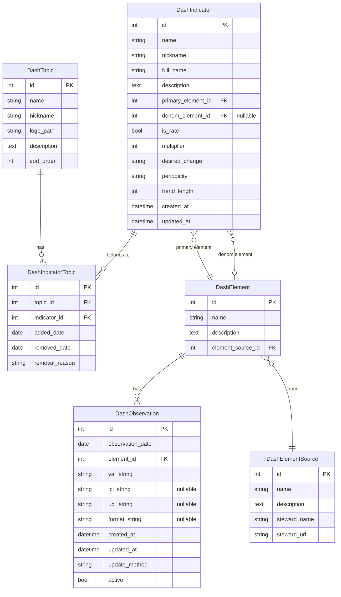

```mermaid
erDiagram
    DashTopic ||--o{ DashIndicatorTopic : "has"
    DashIndicator ||--o{ DashIndicatorTopic : "belongs to"
    DashIndicator }o--|| DashElement : "primary element"
    DashIndicator }o--o| DashElement : "denom element"
    DashElement ||--o{ DashObservation : "has"
    DashElement }o--|| DashElementSource : "from"

    DashTopic {
        int id PK
        string name
        string nickname
        string logo_path
        text description
        int sort_order
    }

    DashIndicator {
        int id PK
        string name
        string nickname
        string full_name
        text description
        int primary_element_id FK
        int denom_element_id FK "nullable"
        bool is_rate
        int multiplier
        string desired_change
        string periodicity
        int trend_length
        datetime created_at
        datetime updated_at
    }

    DashIndicatorTopic {
        int id PK
        int topic_id FK
        int indicator_id FK
        date added_date
        date removed_date
        string removal_reason
    }

    DashElement {
        int id PK
        string name
        text description
        int element_source_id FK
    }

    DashObservation {
        int id PK
        date observation_date
        int element_id FK
        string val_string
        string lcl_string "nullable"
        string ucl_string "nullable"
        string format_string "nullable"
        datetime created_at
        datetime updated_at
        string update_method
        bool active
    }

    DashElementSource {
        int id PK
        string name
        text description
        string steward_name
        string steward_url
    }
```